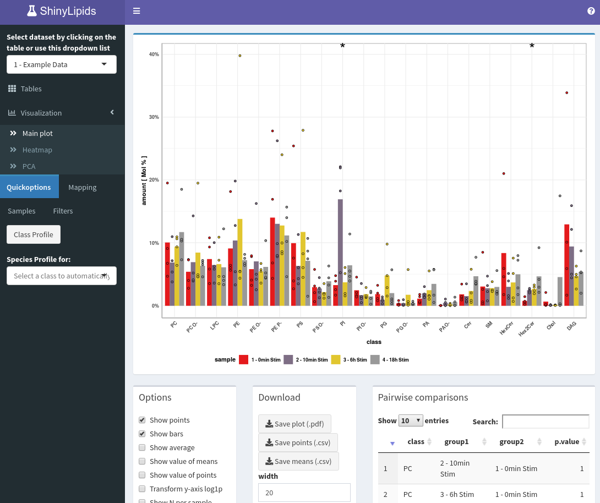

<!-- README.md is generated from README.Rmd. Please edit that file -->

```{r, include = FALSE}
knitr::opts_chunk$set(
  collapse = TRUE,
  comment = "#>",
  fig.path = "man/figures/README-",
  out.width = "100%"
)
```

# ShinyLipids

<!-- badges: start -->
[](https://travis-ci.com/jannikbuhr/ShinyLipids)
[](https://www.tidyverse.org/lifecycle/#maturing)
[](https://codecov.io/gh/jannikbuhr/ShinyLipids)
<!-- badges: end -->

An interactive web application for lipidomics data analysis based on
the R programming language with the shiny framework.



## What is ShinyLipids?

ShinyLipids is a visualization tool for lipidomics data built in R with
the `shiny` package. The original version was developed in 2015
by _Mathias Gerl_ and further enhanced by _Manuel Haußmann_
and _Sebastian Bender_ until August, 2017.
It serves as the primary visualization dashboard for the
[Brügger Lipidomics Group](https://bzh.db-engine.de/default.asp?lfn=2241&fg=4289)
at the Heidelberg Biochemistry Center (BZH).
There is also a great deal of back end infrastructure, built by Mathias,
to support a server with a database,
upload tools and a version of this App for internal use at the BZH.

## What changed?

In 2018 I started working on a new version of ShinyLipids.
The idea is still very much based on the original,
but the internal coding and data structure is designed
to be more consistent and host a safer environment
for the implementation of new features within the R code.
More information can be found on
[my website](https://jmbuhr.de/project/shinylipids/).

## How do I use ShinyLipids?

Make sure you have the latest version of R and RStudio installed.

If you are new to R, head over to

[https://cran.r-project.org/](https://cran.r-project.org/)
and follow the download link suitable for your operating system.
Then, head over to
[https://rstudio.com/products/rstudio/download/#download](https://rstudio.com/products/rstudio/download/#download)
and install RStudio. You can think of R as the engine that runs the Code for
ShinyLipids and of RStudio
as a car with a nice dashboard around the engine to help you the raw power.
Don't worry, there won't be any coding necessary to get started with your
data in ShinyLipids.

Then run this piece of R code to install ShinyLipids with all it's
dependencies^[If you want to publish the Shiny App on RStudio-connect,
you will need a couple of additional packages that
are listed in `app.R`.] from github:

```{r, eval=FALSE}
if ( !("devtools" %in% installed.packages()) ) install.packages("devtools")
devtools::install_github("jannikbuhr/ShinyLipids")
```

(To run the code, copy and paste it into the R console that pops up in the
bottom right corner when you first open RStudio. Then hit Enter.)

ShinyLipids gets the data it needs from a database.
This database needs to contain at least the two tables **id_info** and **data2**
^[the naming is due to back end compatibility].
Of course, you might not have your data in a database or
database-dump file. To get your tabular data (preferably _.csv_)
into such a file, you can use a little helper
function in ShinyLipids, which you can run from an R script.
Before you do so, make sure your tables contain the columns
listed in section [What should my tables look like?](#tables).
Then, read them into R and package them up with `ShinyLipids::createDatabase`.
This could look as follows:

```{r, eval=FALSE}
if ( !("readr" %in% installed.packages()) ) install.packages("readr")
myMedatdata <- readr::read_csv("myMetadata.csv")
myDataset   <- readr::read_csv("myDataset.csv")
ShinyLipids::createDatabase("path/to/your/data.db", myMedatdata, myDataset)
```

Now you are ready to look at your lipids! Run this code for a quick start:

```{r, eval=FALSE}
databaseConnection <- DBI::dbConnect(RSQLite::SQLite(), "path/to/your/data.db")
ShinyLipids::run_app(db = databaseConnection)
```

### What should my tables look like? {#tables}

**id_info**

This is `myMetadata.csv` in the previous example.
Not all columns are needed but `id` and `title` are essential.

|Column           | Description                   |
|:----------------| -----------                   |
|id               | whole number: unique id per dataset |
|title            | text: title of dataset        |
|date_upload      | text: YYYY-MM-DD              |
|status           | text: e.g. in progress        |
|sample_from      | text: owner of sample         |
|date_sample      | text: YYYY-MM-DD              |
|extracted_by     | text: name                    |
|date_extraction  | text: YYYY-MM-DD              |
|measured_by      | text: name                    |
|date_measured    | text: YYYY-MM-DD              |
|distinct_samples | whole number: n of samples    |
|data_lines       | whole number: n of datapoints |
|file             | text: name of raw datafile    |
|instruments      | text: instruments             |

**data2**

This is `myDataset.csv`. 

|Column                     | Description                   |
|:--------------------------| -----------                   |
|id                         | whole number: matches metadata|
|lipid                      | text: format: "Cer 34:1;2"|
|value                      | number:  (assumed to be µM) |
|category                   | text: e.g. SP|
|func_cat                   | text: e.g. SP|
|sample_identifier          | text: e.g. "1Aa"|
|sample                     | text: e.g. "1 - 0min Stim"|
|sample_replicate           | text: e.g. "1 - 0min Stim_A"|
|sample_replicate_technical | text: e.g. "1 - 0min Stim_A_a"|

The lipid column should uniquely identify each measured
lipid. If you use the nomenclature proposed by Liebisch et al.
(https://www.ncbi.nlm.nih.gov/pubmed/23549332), `ShinyLipids`
can extract further information about the lipid from this
column (such as the length of the chains, the number
of double bonds, the amount of hydroxylation etc.).
The Lipid Maps project (https://www.lipidmaps.org/)
aims to provide a database of known lipids. However,
since the first mentioned nomenclature is both human- and machine-readable,
`ShinyLipids` currently prioritizes it over LipidMaps-IDs.
But the groundwork to read in the database of LipidMaps
and convert LM-IDs to the Liebisch et al. format inside of ShinyLipids
has been laid.

The value is expected to be in µM. Using
different units works but the axis labels will still
read µM.

Optionally, your database can contain a table named
"LIPID_CLASS_ORDER_COMPLETE" with
a numeric _class_order_ column associated with a _class_ column.
You can also reorder your lipid classes in the app on bottom of
the main plotting page.

## For advanced use

If you want to run ShinyLipids on your own server connected to a database
or post your findings to shinyapps.io, you will have to download the source code:

```{bash, eval=FALSE}
git clone https://github.com/jannikbuhr/ShinyLipids.git
```

Open the file `app.R`, read the comments and uncomment the specified lines.
Then you
will be able to run the app or use the buttons in the top right corner of
your RStudio code panel.

## Notes

Please note that the 'ShinyLipids' project is released with a
[Contributor Code of Conduct](.github/CODE_OF_CONDUCT.md).
By contributing to this project, you agree to abide by its terms.
