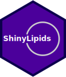

<!-- README.md is generated from README.Rmd. Please edit that file -->

```{r, include = FALSE}
knitr::opts_chunk$set(
  collapse = TRUE,
  comment = "#>",
  fig.path = "man/figures/README-",
  out.width = "100%"
)
```

# ShinyLipids <a href='https://jmbuhr.de/ShinyLipids/'></a>

<!-- badges: start -->
[](https://travis-ci.com/jmbuhr/ShinyLipids)
[](https://www.tidyverse.org/lifecycle/#maturing)
[](https://codecov.io/gh/jmbuhr/ShinyLipids)
<!-- badges: end -->

ShinyLipids is an interactive web application for lipidomics data analysis
written in R with the [shiny](https://shiny.rstudio.com/)
framework.

## Getting started 

First, we need to make sure that you have the latest version of R (and optionally RStudio) installed.
If you are new to R, head over to
[https://cran.r-project.org/](https://cran.r-project.org/)
and follow the download link suitable for your operating system.
Then install RStudio from [https://rstudio.com/products/rstudio/download/#download](https://rstudio.com/products/rstudio/download/#download).
Don't worry, there won't be any coding necessary to get started with your
own data in ShinyLipids.

Now open up RStudio and run this piece of R code to
install `ShinyLipids` with all it's
dependencies from github
(To run the code, copy and paste it into the R console that pops up in the
bottom right corner when you first open RStudio. Then hit Enter.):

```{r, eval=FALSE}
if ( !("remotes" %in% installed.packages()) ) install.packages("remotes")
remotes::install_github("jmbuhr/ShinyLipids")
```

To get a first glimpse, run these lines to
see the example data the comes with `ShinyLipids`:

```{r, eval=FALSE}
path <- system.file("extdata/exampleDatabase.db", package = "ShinyLipids")
databaseConnection <- DBI::dbConnect(RSQLite::SQLite(), path)
ShinyLipids::run_app(db = databaseConnection)
```


## Getting your own data into ShinyLipids

`ShinyLipids` loads the data from a database or
a database-dump file as in the example above (`exampleDatabase.db`).
This database needs to contain at least the two tables **id_info** and **data2**
^[the naming is due to back-end compatibility].
Of course, you might not have your data in a database or
database-dump file. To get your tabular data (preferably _.csv_)
into such a file, you can use a little helper
function in `ShinyLipids`, which you can run from an R script.
Before you do so, make sure your tables contain the columns
listed in section [What should my tables look like?](#tables).
Then, read them into R and package them up with `ShinyLipids::createDatabase`.
This could look like this:

```{r, eval=FALSE}
if ( !("readr" %in% installed.packages()) ) install.packages("readr")
path <- "path/to/your/data.db"
myMedatdata <- readr::read_csv("myMetadata.csv")
myDataset   <- readr::read_csv("myDataset.csv")
ShinyLipids::createDatabase(path = path, myMedatdata, myDataset)
```

Now you are ready to look at your lipids!
Replace `"path/to/your/data.db"` with the actual
filepath to your database-dump file
and run:

```{r, eval=FALSE}
databaseConnection <- DBI::dbConnect(RSQLite::SQLite(), path)
ShinyLipids::run_app(db = databaseConnection)
```

### What should my tables look like? {#tables}

**id_info**

This is `myMetadata.csv` in the previous example.
Not all columns are needed but `id` and `title` are essential.

|Column           | Description                   |
|:----------------| -----------                   |
|id               | whole number: unique id per dataset |
|title            | text: title of dataset        |
|date_upload      | text: YYYY-MM-DD              |
|status           | text: e.g. in progress        |
|sample_from      | text: owner of sample         |
|date_sample      | text: YYYY-MM-DD              |
|extracted_by     | text: name                    |
|date_extraction  | text: YYYY-MM-DD              |
|measured_by      | text: name                    |
|date_measured    | text: YYYY-MM-DD              |
|distinct_samples | whole number: n of samples    |
|data_lines       | whole number: n of datapoints |
|file             | text: name of raw datafile    |
|instruments      | text: instruments             |

**data2**

This is `myDataset.csv`. 

|Column                     | Description                   |
|:--------------------------| -----------                   |
|id                         | whole number: matches metadata|
|lipid                      | text: format: "Cer 34:1;2"|
|value                      | number:  (assumed to be µM) |
|category                   | text: e.g. SP|
|func_cat                   | text: e.g. SP|
|sample_identifier          | text: e.g. "1Aa"|
|sample                     | text: e.g. "1 - 0min Stim"|
|sample_replicate           | text: e.g. "1 - 0min Stim_A"|
|sample_replicate_technical | text: e.g. "1 - 0min Stim_A_a"|

The lipid column should uniquely identify each measured
lipid. If you use the nomenclature proposed by Liebisch et al.
(https://www.ncbi.nlm.nih.gov/pubmed/23549332), `ShinyLipids`
can extract further information about the lipid from this
column (such as the length of the chains, the number
of double bonds, the amount of hydroxylation etc.).
The value is expected to be in µM. Using
different units works but the axis labels will still
read µM.

Optionally, your database can contain a table named
"LIPID_CLASS_ORDER_COMPLETE" with
a numeric _class_order_ column associated with a _class_ column.

## For advanced use

If you want to run ShinyLipids on your own server, connected to a database
or post your findings to [shinyapps.io](https://www.shinyapps.io/),
you will have to download the source code by
either running `git clone https://github.com/jmbuhr/ShinyLipids.git` from
the command line or by visiting
[https://github.com/jmbuhr/ShinyLipids](https://github.com/jmbuhr/ShinyLipids)

Open the file `app.R`, read the comments and uncomment the specified lines.
Then can to run the app or use the buttons in the top right corner of
your RStudio code panel.

You can find further information in the
[documentation](https://jmbuhr.de/ShinyLipids/).

## Notes

The first version of ShinyLipids was developed in 2015
by _Mathias Gerl_ and further enhanced by _Manuel Haußmann_
and _Sebastian Bender_ until August, 2017.
The ideas and intentions of this new version by [Jannik Buhr](https://jmbuhr.de/)
are still based on the original,
but the code and data structure is designed
to be more consistent and host a safer environment
for the implementation of new features.
You can find more information about that
in the [documentation](https://jmbuhr.de/ShinyLipids/articles/Technical-aspects.html).

Please note that the 'ShinyLipids' project is released with a
[Contributor Code of Conduct](.github/CODE_OF_CONDUCT.md).
By contributing to this project, you agree to abide by its terms.
